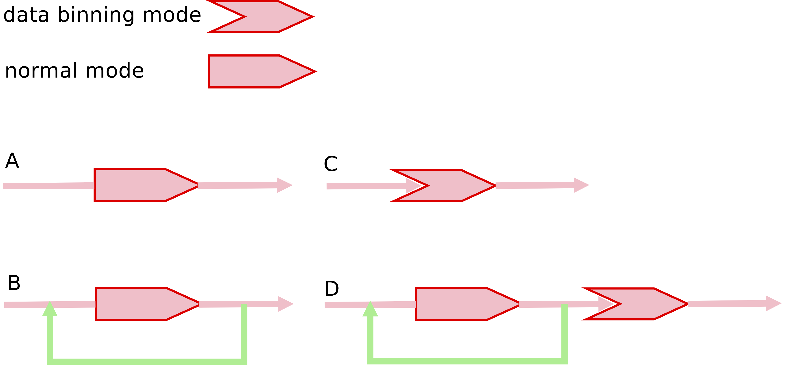

### Parameter: isbin

**Definition**

Key control flag. It is used to determine whether we need to enter the data binning mode. 

**Type**

Integer

**Default value**

1

**Component**

ALL

**Behavior**

There are two possible values for *isbin* parameter so far:

* *isbin* = 1, normal mode.

* *isbin* = 2, data binning mode.

When the quantum impurity solver is in the data binning mode, the current iteration number (```iter```, it is a internal variable) will be fixed to 999, the *nsweep* and *nwrite* parameters will be increased by a factor of ten.

From the combinations of *isscf* and *isbin* parameters, we can reach the following four running modes:

* A: *isscf* = 1, *isbin* = 1. The quantum impurity solver is called only once. No DMFT self-consistent calculation. No data binning mode.

* B: *isscf* = 2, *isbin* = 1. The quantum impurity solve is called periodically in the DMFT self-consistent calculation. Once the convergence is reached, the calculation will stop. No data binning mode.

* C: *isscf* = 1, *isbin* = 2. The quantum impurity solver is called only once in the data binning mode. No DMFT self-consistent calculation.

* D: *isscf* = 2, *isbin* = 2. The quantum impurity solves is called periodically in the DMFT self-consistent calculation. During the iterations, the quantum impurity solver is in normal mode. After the convergence is reached, the quantum impurity solver will be called once again. But at this time, the data binning mode is activated automatically.


**Figure |** The four running modes for quantum impurity solvers.

Please see the above figure for an intuitive view of the four running modes. If we want to perform DFT + DMFT calculations, mode A will be a good choice. Mode B is often used to solve model Hamiltonians iteratively and quickly to judge whether the results are reasonable. Once the results are reasonable and what we expect, and we want more accurate data, then we can use mode C. Mode D can be viewed as a combination of mode B and mode C, it is seldom used.

**Comment**

See [isscf](p_isscf.md) parameter for more details.