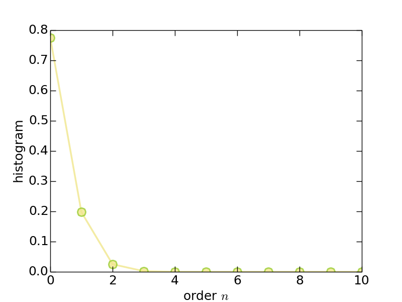
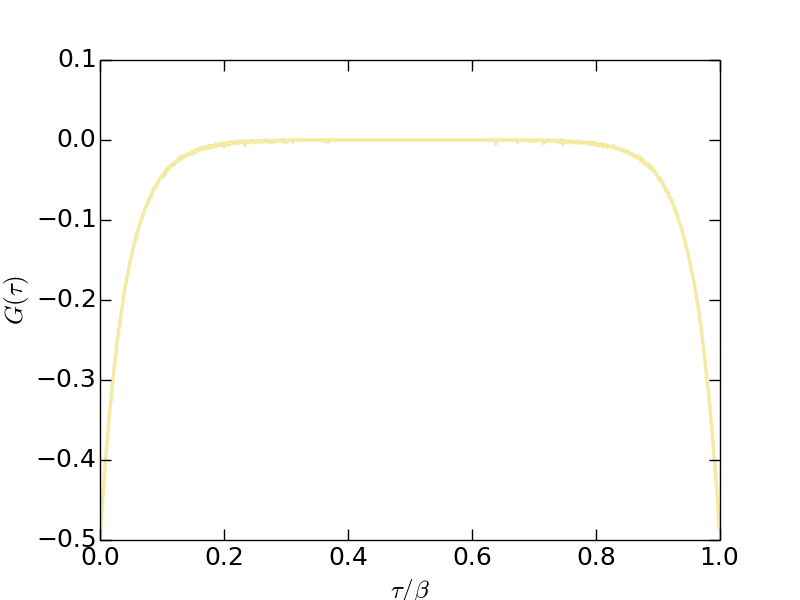
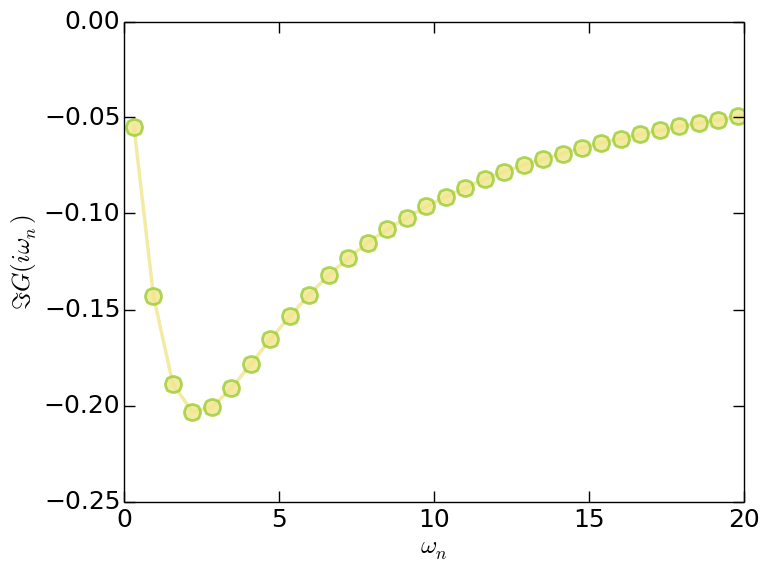
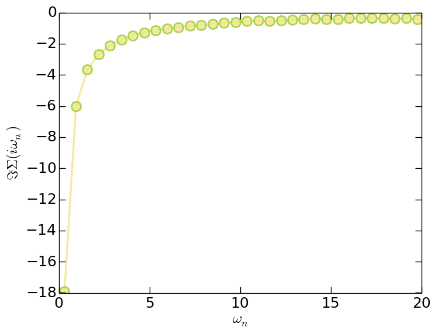

### General Coulomb interaction

> NOTE:

> This tutorial will take you about five hours.

**Introduction**

In this tutorial, we will show you how to use the iQIST software package to solve a two-band Hubbard with rotationally invariant Coulomb interaction.

The interaction term of the Hubbard model are as follows:

$$
\begin{align}
\hat{H}_{\text{loc}} = &- \mu \sum_{\alpha\sigma}n_{\alpha\sigma} + U\sum_{\alpha} n_{\alpha\uparrow}n_{\alpha\downarrow} \\
    & + U^{\prime} \sum_{\alpha > \gamma, \sigma} n_{\alpha\sigma}n_{\gamma\bar{\sigma}}
    + (U^{\prime} - J) \sum_{\alpha > \gamma, \sigma} n_{\alpha\sigma}n_{\gamma\sigma} \nonumber \\
    & - J \sum_{\alpha \neq \gamma} (d^{\dagger}_{\alpha\downarrow}d^{\dagger}_{\gamma\uparrow}d_{\gamma\downarrow}d_{\alpha\uparrow} + d^{\dagger}_{\gamma\uparrow}d^{\dagger}_{\gamma\downarrow}d_{\alpha\uparrow}d_{\alpha\downarrow} + h.c.).\nonumber
\end{align}
$$

Here $$\alpha$$ and $$\gamma$$ are the orbital indices, $$\sigma$$ the spin index, $$\mu$$ the chemical potential, $$U$$ ($$U^{\prime}$$) the intra-orbital (inter-orbital) Coulomb interaction, and $$J$$ the Hund's exchange interaction. Unless otherwise specified, $$\mu$$ is chosen to meet the half-filling condition. The $$U$$ ($$U^{\prime}$$) and $$J$$ parameters fulfill the relation $$U^{\prime} = U - 2J$$. In this tutorial, a semicircular density of states with half bandwidth $$D = 2t$$ is used, which corresponds to the infinite-dimensional Bethe lattice. We solve the Hubbard model using single-site DMFT with a state-of-the-art CT-HYB quantum Monte Carlo impurity solver.

The model parameters are as follows:

* $$U_c$$ = 4.0
* $$U_v$$ = 2.0
* $$J_z$$ = 1.0
* $$J_s$$ = 1.0
* $$J_p$$ = 1.0
* $$\mu$$ = 3.50

**Recipes**

Next we just follow the procedures described in the [iQIST recipes](../ch03/recipes.md) section.

**(1)** Choose suitable component

Since the local Hamiltonian contain the spin-flip and pair-hopping terms, it is not diagonal under the occupation number basis. So the segment representation algorithm is not valid in this case. We have to use the general matrix version of CT-HYB quantum impurity solvers. In this tutorial, we choose the **BEGONIA** component to solve it. Of course, the **LAVENDER**, **PANSY**, **MANJUSHAKA**, and **CAMELLIA** components are also applicable.

**(2)** Design the programs and scripts

Since the Hubbard model is defined in a Bethe lattice whose density of states is semi-circular, the self-consistent equation for the dynamical mean-field theory reads:

$$
G(\tau) = t^2 \Delta(\tau)
$$

As mentioned before, the **BEGONIA** component (and the other quantum impurity solver components) contains a mini dynamical mean-field engine and the above self-consistent equation is already implemented by default. So, we can use the **BEGONIA** component alone without help from any external programs or scripts.

**(3)** Prepare the input files

Please create a working directory for this tutorial:

```
$ mkdir test21
```

As for the **BEGONIA** component (and the other general matrix version of CT-HYB quantum impurity solvers), the *atom.cix* file is always necessary. Without it, the impurity solver won't run correctly. We have to use the **JASMINE** component to generate it at first. The configuration file (*atom.config.in*) for the **JASMINE** component is attached as follows:

```
!!!-----------------------------------------------------------------------
!!! source  : t21/atom.config.in
!!! solver  : JASMINE
!!! purpose : for tutorial
!!! author  : yilin wang (email:qhwyl2006@126.com)
!!!-----------------------------------------------------------------------

!!>>> setup general control flags
!!------------------------------------------------------------------------
  ibasis : 1
  ictqmc : 1
  icu    : 1
  icf    : 0
  isoc   : 0

!!>>> setup common variables for jasmine
!!------------------------------------------------------------------------
  nband  : 2
  nspin  : 2
  norbs  : 4
  ncfgs  : 16
  nmini  : 0
  nmaxi  : 4

!!>>> setup common variables for jasmine
!!------------------------------------------------------------------------
  Uc     : 4.00
  Uv     : 2.00
  Jz     : 1.00
  Js     : 1.00
  Jp     : 1.00
  Ud     : 0.00
  Jh     : 0.00
  lambda : 0.00
  mune   : 0.00
```

Please setup your *atom.config.in* file, or just copy it from the *iqist/tutor/t21* directory:

```
$ cp iqist/tutor/t21/atom.config.in test21
```

In the *atom.config.in* file, the local Hamiltonian is defined. Then we solve it using the **JASMINE** component.

```
$ cd test21
$ pwd
$ atomic
```

Here *atomic* is the executable program of the **JASMINE** component. We assume that it is in the *iqist/build* directory and added to the PATH. The *atomic* is extremely fast. After the calculation is finished, there are a lot of output files in the *test21* folder. Try to find out the *atom.cix* file and ignore the others. Is it ready? You can use any text editor to open and read the *atom.cix* file. But please don't edit it for ever.

Next we have to prepare the *solver.ctqmc.in* file for the **BEGONIA** component. An official version is attached as follows.

```
!!!-----------------------------------------------------------------------
!!! source  : t21/solver.ctqmc.in
!!! solver  : BEGONIA
!!! purpose : for tutorial
!!! author  : yilin wang (email:qhwyl2006@126.com)
!!!-----------------------------------------------------------------------

!!>>> setup general control flags
!!------------------------------------------------------------------------
  isscf  : 2
  issun  : 2
  isspn  : 1
  isbin  : 1

!!>>> setup common variables for quantum impurity model
!!------------------------------------------------------------------------
  nband  : 2
  nspin  : 2
  norbs  : 4
  ncfgs  : 16
  nzero  : 256
  niter  : 20
  U      : 4.00
  Uc     : 4.00
  Uv     : 2.00
  Jz     : 1.00
  Js     : 1.00
  Jp     : 1.00
  mune   : 3.50
  beta   : 10.0
  part   : 0.50
  alpha  : 0.70

!!>>> setup common variables for quantum impurity solver
!!------------------------------------------------------------------------
  mkink  : 1024
  mfreq  : 8193
  nfreq  : 128
  ntime  : 1024
  npart  : 4
  nflip  : 20000
  ntherm : 20000000
  nsweep : 200000000
  nwrite : 20000000
  nclean : 100000
  nmonte : 100
  ncarlo : 100
```

But you can also copy it from the *iqist/tutor/t21* directory:

```
$ cp iqist/tutor/t21/solver.ctqmc.in .
```

The important parameters in the *solver.ctqmc.in* file are as follows:

* *isscf = 2*: Define the DMFT self-consistent computational mode.
* *nband = 2*, *norbs = 4*, and *ncfgs = 16*: Specify a two-band Hubbard model.
* *nzero = 256*: Maximum number of non-zero matrix elements for *F*-matrix.
* *mune = 3.5* : Chemical potential $$\mu$$.
* *beta = 10.0* : Inverse temperature $$\beta$$.
* *npart = 4*: Number of parts that the imaginary-time axis is splitted.

In fact, you can create a simplified *solver.ctqmc.in* file which contains only the *nband*, *norbs*, *ncfgs*, *nzero*, *mune*, and *beta* parameters. The **BEGONIA** component will supplement the rest using default settings. Noted that now the *Uc*, *Uv*, *Jz*, *Js* and *Jp* parameters in the *solver.ctqmc.in* file are used as a reference. All of the information about the local Hamiltonian is defined in the *atom.config.in* file and dealed with the **JASMINE** component. The **BEGONIA** component is not responsible for constructing the local Hamiltonian model.

As for the format and grammar for the *solver.ctqmc.in* file, see [solver.ctqmc.in](../ch04/in_ctqmc.md) for more details.

**(4)** Let's go

Now everything is ready. We can perform the calculation. Please execute the following command in the terminal, and then do another job. This calculation will cost you about five hours.

```
$ ctqmc
```

> NOTE:

> Here we assume that the executable program for the **BEGONIA** component is in *iqist/build/ctqmc*, and the directory *iqist/build* has been appended to the environment variable **PATH**.

**(5)** Post-processing

As usual we use the Python/matplotlib package to visualize the calculated results. If you are not familiar with this powerful tool, please visit its official website:`http://matplotlib.org`. Here is a sample Python script for plotting the imaginary-time Green's function $$G(\tau)$$, you can modify it to fit your requirements.

```python
#!/usr/bin/env python

import numpy
import matplotlib
matplotlib.use("Agg") # setup backend
import matplotlib.pyplot as plt

# read data
beta = 10.0
bi, ti, tau, gtau, error = numpy.loadtxt('solver.green.dat', unpack = True)
tau = tau[0:1023] / beta

# plot it
plt.figure(0)
lines = plt.plot(tau, gtau[0:1023], alpha = 0.8, clip_on = True)

# setup line properties
plt.setp(lines[0], linewidth = 2.5, color = 'khaki')

# setup tics
plt.xticks(fontsize = 18)
plt.yticks(fontsize = 18)
plt.tick_params(length = 8, width = 1.0, which = 'major')
plt.tick_params(length = 4, width = 0.5, which = 'minor')

# setup labels
plt.xlabel(r"$\tau/\beta$", fontsize = 18)
plt.ylabel(r"$G(\tau)$", fontsize = 18)

# setup yranges
plt.xlim(0.0,1.0)

# output the figure
plt.savefig("21gtau.png")
```

Next we will show some visualized results. The following figures were generated using the above Python script with slight modifications. You can compare them with your own results to see whether your calculations are correct.

* Histogram (*solver.hist.dat*)



**Figure** | The histogram for perturbation expansion series.

---

* Imaginary-time Green's function (*solver.green.dat*)



**Figure** | The imaginary-time Green's function $$G(\tau)$$.

---

* Matsubara Green's function (*solver.grn.dat*)



**Figure** | The imaginary part of Matsubara Green's function $$\Im G(i\omega_n)$$.

---

* Matsubara self-energy function (*solver.sgm.dat*)



**Figure** | The imaginary part of Matsubara self-energy function $$\Im \Sigma(i\omega_n)$$.

---

Since the orbitals in this model are degenerated, so for $$G(\tau)$$, $$G(i\omega_n)$$, and $$\Sigma(i\omega_n)$$ we only plot the data for the first band. Clearly, the system is in insulating state.

**Adventures**

**(1)** Adjust the parameters

You can adjust the *mune*, *beta*, *npart*, and *nsweep* parameters, and redo the calculations, to see what will happen.

**(2)** Parallel computation

Try to execute the CT-HYB quantum impurity solvers parallelly. Such as 

```
$ mpiexec -n 8 ctqmc
```

This will greatly reduce the numerical fluctuation in physical observable with the same *nsweep* parameter.

**(3)** Try the **LAVENDER** component

Use the **LAVENDER** component to do the calculation again. The original *atom.cix* file can be used directly. The *solver.ctqmc.in* file can be the same.

**(4)** Try the **PANSY** and **MANJUSHAKA** components

Since the *atom.cix* used by the **BEGONIA** and **LAVENDER** components is not compatible with the one used by the **PANSY** and **MANJUSHAKA** components. So we have to rebuild the *atom.cix* file at first. Please change *ictqmc* from 1 to 2 in the *atom.config.in* file, and then use the **JASMINE** component to generate the *atom.cix* file again. Then you can execute the **PANSY** or **MANJUSHAKA** component to solve the model. It is unnecessary to modify the *solver.ctqmc.in* file. Finally, you can compare the calculated results obtained by these two kinds of general matrix version of CT-HYB quantum impurity solvers. That's all.