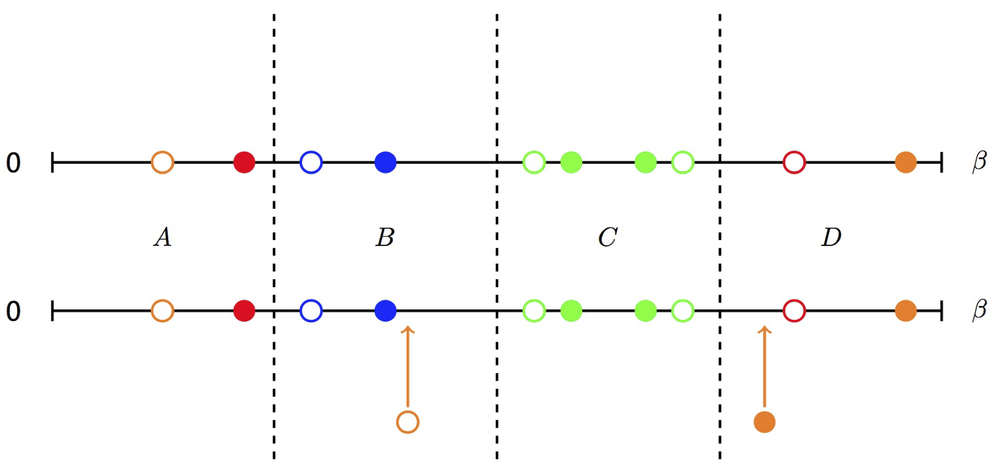

### Divide-and-conquer algorithm

**Figure** | Illustration of the divide-and-conquer algorithm. The imaginary time axis is split into four parts with equal length by vertical dashed lines. The open (filled) circles mean creation (annihilation) operators. The color is used to distinguish different flavors. It shows that a creation operator is inserted into the $$B$$ part, while a annihilation operator is inserted into the $$D$$ part.

The Monte Carlo updates, such as inserting (removing) a pair of creation and annihilation operators, usually modify the diagrammatic configuration locally. Based on this fact, we implemented a divide-and-conquer algorithm to speed up the trace evaluation. As illustrated in the above figure, we divide the imaginary time axis into a few parts with equal length. For each part, there will be zero or nonzero fermion operators, and we save their matrix products when evaluating the local trace in the beginning. In the next Monte Carlo sampling, we first determine which parts may be modified or influenced, and then for these parts we recalculate the matrix products from scratch and save them again. For the unchanged parts, we will leave them unchanged. Finally, we will multiply the contributions of all parts to obtain the final local trace. By using this divide-and-conquer trick, we can avoid redundant computations and speed up the calculation of the acceptance probability $$p$$. This trick can be combined with the GQNs algorithm to achieve a further speedup. 