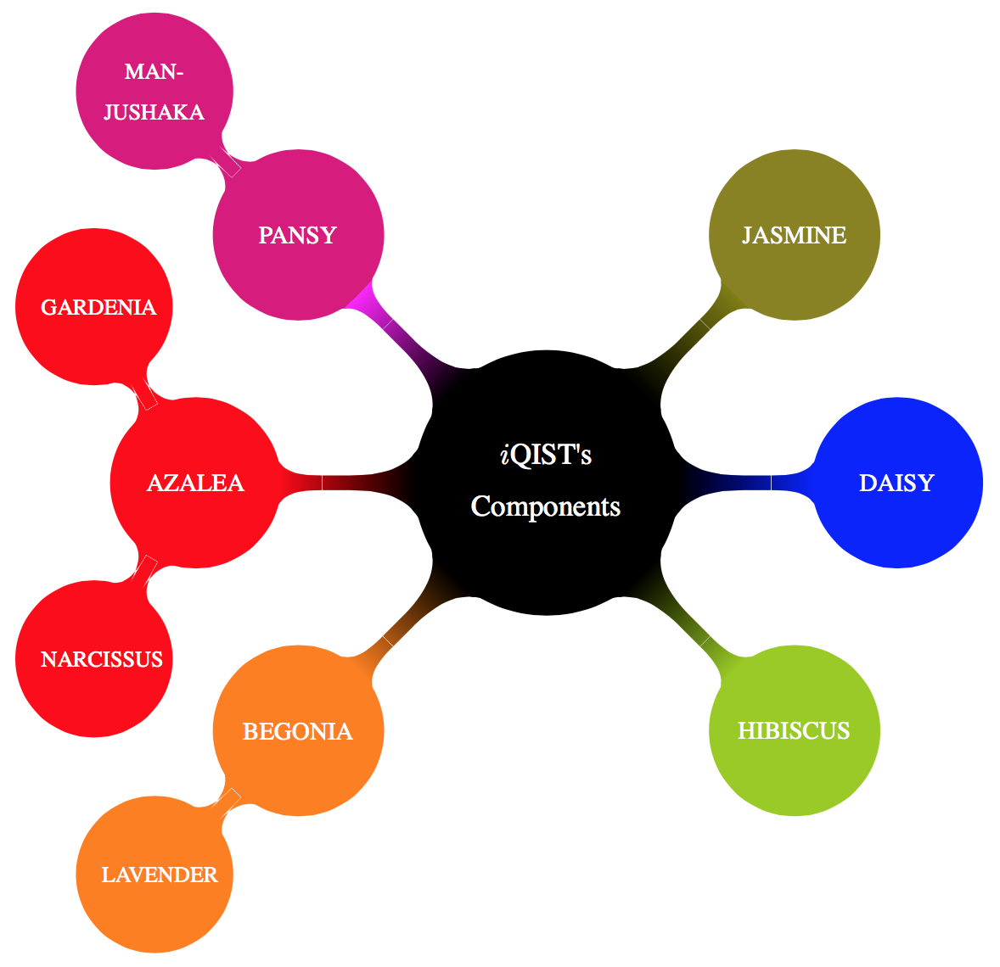

## Components

The iQIST software package is much more complex and powerful than what you can imagine. It contains several components which can be used to solve different impurity problems, prepare the input files, post-process the calculated results, etc.

**Figure** | Schematic picture for the iQIST's components. Components on the LHS are all CT-HYB solvers, **JASMINE** is the atomic eigenvalue solver, **DAISY** is a HF-QMC solver, and **HIBISCUS** contains other pre-processing and post-processing tools.

According to their abilities and functions, the components of the iQIST software package can be classified into the following catalogues:

### Continuous-time quantum Monte Carlo impurity solvers (segment representation version)

* **AZALEA** component
* **GARDENIA** component
* **NARCISSUS** component

For the details of these quantum impurity solvers, please see the chapter [Quantum Monte Carlo impurity solvers](../ch04/README.md).

### Continuous-time quantum Monte Carlo impurity solvers (general matrix version)

* **BEGONIA** component
* **LAVENDER** component
* **CAMELLIA** component (*not ready*)
* **MANJUSHAKA** component (*unstable*)
* **PANSY** component (*unstable*)

For the details of these quantum impurity solvers, please see the chapter [Quantum Monte Carlo impurity solvers](../ch04/README.md).

### Hirsch-Fye quantum Monte Carlo impurity solver

* **DAISY** component

For the details of these quantum impurity solvers, please see the chapter [Quantum Monte Carlo impurity solvers](../ch04/README.md).

### Auxiliary tools

* **HIBISCUS** component
* **JASMINE** component

For the details of these tools, please see the chapters [Atomic eigenvalue problem solver](../ch06/README.md) and [Auxiliary tools](../ch07/README.md).

### Applications

* **SAKURA** component (DFT + DMFT code, *not ready*)
* **ROSEMARY** component (ladder dual fermions code, *not ready*)

For the details of these applications, please see the chapter [Applications](../ch05/README.md).

### Miscellanies

Besides the above components, the iQIST software package also includes many useful and interesting things, such as:

* **The Reference Manual** (It is me!)
* **Application Programming Interfaces** (Fortran and Python versions)
* **Common Service Modules Library** (**CSML**)
* **Common Service Subroutines Library** (**CSSL**)
* **Tutorials** and **Examples**

!!! note

    In the **Common Service Modules Library** and **Common Service Subroutines Library**, we implement the numerical infrastructures for the iQIST software package. They can be reused in the other scientific computation projects.