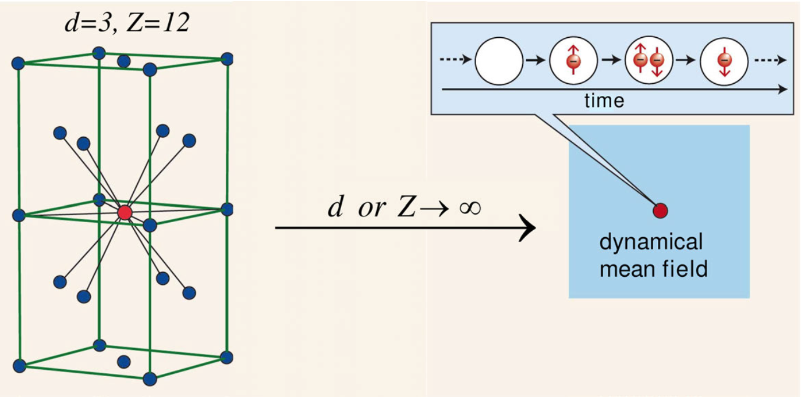

# Motivation

**DMFT**

Dynamical mean-field theory (DMFT) and its extensions play a very important role in contemporary studies of correlated electron systems (see **Figure 1**). The broad applications of this technique range from the study of Mott transitions, unconventional superconductivity in Cu- and Fe-based superconductors, and non-Fermi liquid behaviors, to the investigation of anomalous transport properties of transition metal oxides. For many of these applications, DMFT is the currently most powerful and reliable (sometimes the only) technique available and has in many cases produced new physical insights. Furthermore, the combination of *ab initio* calculation method (such as density functional theory) with DMFT allows to compute the subtle electronic properties of realistic correlated materials, including partially filled *3d*- and *4d*-electron transition metal oxides, where lattice, spin and orbital degrees of freedom all coupled (see **Figure 2**).

**Figure 1** | The hierarchical structure of DMFT and its extensions. The iQIST software package can be used as a computational engine of them.

**Figure 2** | The hierarchical structure of DFT + DMFT and its extensions. The iQIST software package can be used as a computational engine of them.

---

**Quantum Impurity Solvers**

The key idea of DMFT is to map the original correlated lattice model into a quantum impurity model whose mean-field bath is determined self-consistently (see **Figures 3** and **4**). Thus, the central task of a DMFT simulation becomes the numerical solution of the quantum impurity problem. During the past several decades, many methods have been tested as impurity solvers, including the exact diagonalization (ED), equation of motion (EOM), Hubbard-I approximation (HIA), iterative perturbation theory (IPT), non-crossing approximation (NCA), fluctuation-exchange approximation (FLEX), and quantum Monte Carlo (QMC). Among the methods listed above, the QMC method has several very important advantages, which makes it so far the most flexible and widely used impurity solver. First, it is based on the imaginary time action, in which the infinite bath has been integrated out. Second, it can treat arbitrary couplings, and can thus be applied to all kinds of phases including the metallic phase, insulating state, and phases with spontaneous symmetry breaking. Third, the QMC method is numerically exact with a *controllable* numerical error. In other words, by increasing the computational effort the numerical error of the QMC simulation can be systematically reduced. For these reasons, the QMC algorithm is considered as the method of choice for many applications.

**Figure 3** | A schematic diagram of the key idea of DMFT.

**Figure 4** | A schematic diagram of the self-consistent iteration of DMFT. Actually, the role played by the iQIST software package is the quantum impurity solver.

---

**CT-QMC Impurity Solvers**

Several QMC impurity solvers have been developed in the past three decades. An important innovation was the Hirsch-Fye QMC (HF-QMC) impurity solver, in which the time axis is divided into small time steps and the interaction term in the Hamiltonian is decoupled on each time step by means of a discrete Hubbard-Stratonovich auxiliary field. HF-QMC has been widely used in the early studies of DMFT, but is limited by the discretization on the time axis and also by the form of the electronic interactions (usually only density-density interactions can be treated). Recently, a new class of more powerful and versatile QMC impurity solvers, continuous-time quantum Monte Carlo (CT-QMC) algorithms, have been invented. In the CT-QMC impurity solvers, the partition function of the quantum impurity problem is diagrammatically expanded, and then the diagrammatic expansion series is evaluated by stochastic Monte Carlo sampling. The continuous-time nature of the algorithm means that operators can be placed at any arbitrary position on the imaginary time interval, so that time discretization errors can be completely avoided. Depending on how the diagrammatic expansion is performed, the CT-QMC approach can be further divided into interaction expansion (or weak coupling) CT-QMC (CT-INT), auxiliary field CT-QMC (CT-AUX), and hybridization expansion (or strong coupling) CT-QMC (CT-HYB).

---

**CT-HYB Impurity Solvers**

At present, the CT-HYB is the most popular and powerful impurity solver, since it can be used to solve multi-orbital impurity model with general interactions at low temperature. In single-site DMFT calculations, the computational efficiency of CT-HYB is much higher than that of CT-INT and HF-QMC, especially when the interactions are strong. However, in order to solve more complicated quantum impurity models (for example, five-band or seven-band impurity model with general interactions and spin-orbital coupling) efficiently, further improvements of the CT-HYB impurity solvers are needed. In recent years many tricks and algorithms have been developed to increase the efficiency and accuracy of original CT-HYB impurity solver, such as the truncation approximation, Krylov subspace iteration, orthogonal polynomial representation, PS quantum number, lazy trace evaluation, and skip listing method, and matrix product state implementation, etc.

---

**The iQIST Software Package**

As the state-of-the-art CT-HYB impurity solvers become more and more sophisticated and specialized, it is not easy anymore to master all their facets and build ones implementations from scratch. Hence, we believe that it is a good time to provide a CT-HYB software package for the DMFT community such that researchers can focus more on the physical questions, instead of spending much time on (re-)implementing efficient codes. In fact, there are some valuable efforts in this direction, such as TRIQS, ALPS, ALPSCore, comsuite, w2dynamics, Haule's eDMFT codes, etc. However, a flexible, extensible, and highly efficient CT-HYB impurity solver is still lacking. The purpose of this reference manual is to present our solution -- the open source software package iQIST -- which contains several well-implemented and thoroughly tested modern CT-HYB impurity solvers, and the corresponding pre- and post-processing tools. Originally the iQIST software package was internally used in our group. Now we release it publicly and hope that the whole community will benefit from it.
