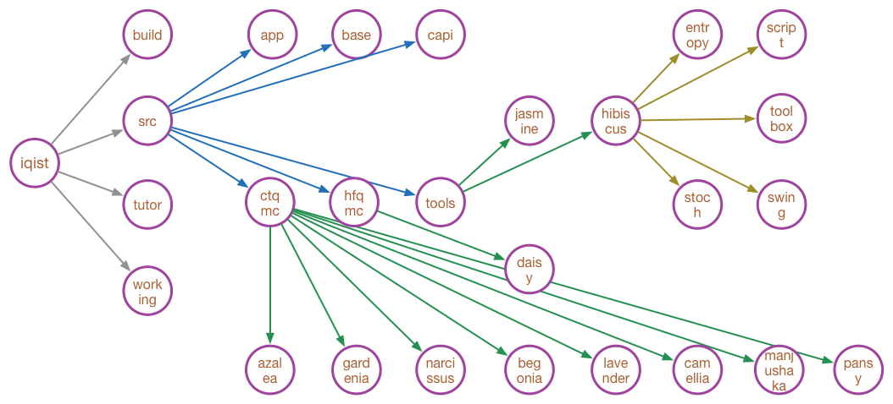

## Directory structures

The uncompressed iQIST software package is somewhat complicated, but have a rich content. We think that it is helpful to introduce the detailed directory structure of it. As has been explained before, in the following, we always use the term **iqist** to denote the top folder which contains the uncompressed iQIST software package.



**Figure** | The directory structures of the iQIST software package.

### Where is the compling system?

```
iqist/build
```

### Where are the executable programs installed by default?

```
iqist/build
```

> NOTE: 

> You have to compile the iQIST successfully, and then execute 
```
$ iqist/build/x_setup.sh
```
at first. So that the executable programs will be copied into the iqist/build directory.

### Where are the source codes?

```
iqist/src
```

### Where are the applications or plugins?

```
iqist/src/app
```

### Where is the base library?

```
iqist/src/base
```

> NOTE:

> The base library includes CSSL and CSML, which provide the numerical infrastructures for the other components of iQIST.

### Where are the application programming interfaces?

```
iqist/src/capi
```

### Where are the quantum impurity solvers?

* For CT-QMC quantum impurity solvers

```
iqist/src/ctqmc/azalea
iqist/src/ctqmc/begonia
iqist/src/ctqmc/camellia
iqist/src/ctqmc/gardenia
iqist/src/ctqmc/lavender
iqist/src/ctqmc/manjushaka
iqist/src/ctqmc/narcissus
iqist/src/ctqmc/pansy

```

* For HF-QMC quantum impurity solvers

```
iqist/src/hfqmc/daisy
```

### Where is the atomic eigenvalue problem solver?

```
iqist/src/tools/jasmine
```

### Where are the auxiliary tools?

```
iqist/src/tools/hibiscus
```

### Where are the documentations?

Unfortunately, the documentations are not included in the iQIST software package. The official reference manual is released on the following website:

```
https://www.gitbook.com/book/huangli712/iqist/details
```

### Where are the tutorials?

```
iqist/tutor
```

### Where are the benchmark cases?

```
iqist/working
```