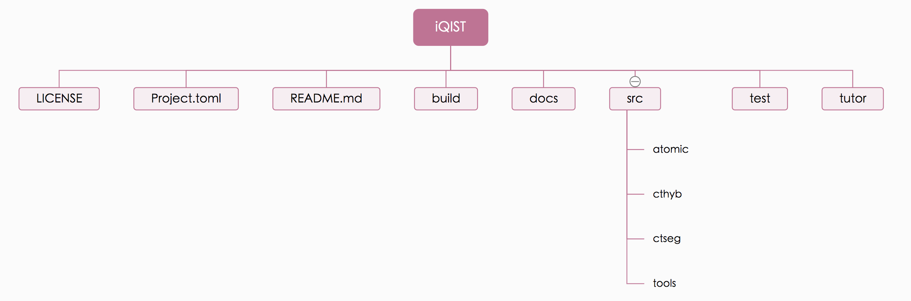

# Directory Structures

The uncompressed iQIST software package is somewhat complicated, but have a rich content. We think that it is helpful to introduce the detailed directory structure of it. As has been explained before, in the following, we always use the term **iqist** to denote the top folder which contains the uncompressed iQIST software package.



**Figure 1** | The directory structures of the iQIST software package.

**Where is the compling system?**

```
iqist/build
```

**Where are the source codes?**

```
iqist/src
```

**Where are the quantum impurity solvers?**

```
iqist/src/ctseg
iqist/src/cthyb
```

**Where is the atomic eigenvalue problem solver?**

```
iqist/src/atomic
```

**Where are the auxiliary tools?**

```
iqist/src/tools
```

**Where are the documentations?**

```
iqist/docs
```

**Where are the tutorials?**

```
iqist/tutor
```

**Where are the benchmark cases?**

```
iqist/test
```
