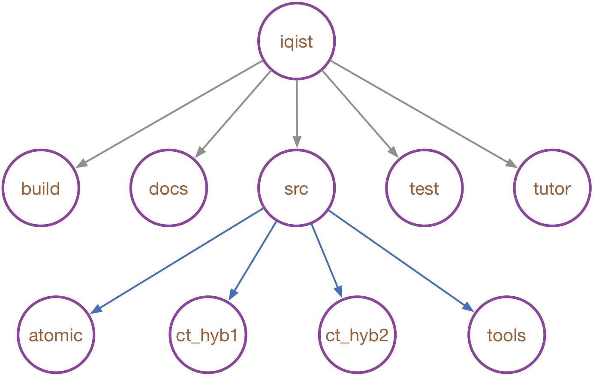

# Directory structures

The uncompressed iQIST software package is somewhat complicated, but have a rich content. We think that it is helpful to introduce the detailed directory structure of it. As has been explained before, in the following, we always use the term **iqist** to denote the top folder which contains the uncompressed iQIST software package.



**Figure** | The directory structures of the iQIST software package.

**Where is the compling system?**

```
iqist/build
```

**Where are the source codes?**

```
iqist/src
```

**Where are the quantum impurity solvers?**

* For CT-QMC quantum impurity solvers

```
iqist/src/ct_hyb1
iqist/src/ct_hyb2
```

**Where is the atomic eigenvalue problem solver?**

```
iqist/src/atomic
```

**Where are the auxiliary tools?**

```
iqist/src/tools
```

**Where are the documentations?**

```
iqist/docs
```

!!! warning

    The documentations for the iQIST software package are written by using the *Markdown* language and the *Julia's Documenter.jl* package. You can type the following command in the terminal to build the documentations:
    ```shell
    $ julia make.jl
    ```
    or you can read the official reference manual in the following website:
    ```
    https://huangli712.github.io/projects/acflow/index.html
    ```

**Where are the tutorials?**

```
iqist/tutor
```

**Where are the benchmark cases?**

```
iqist/test
```
