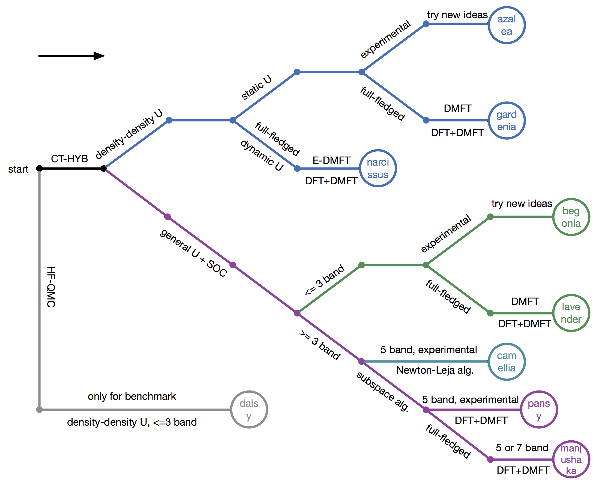

## How to choose suitable quantum impurity solvers?

At a first glance, you may feel puzzled why there are so many continuous-time quantum impurity solvers in the iQIST software package. What are the differences between them? Do we really need them? How to choose a suitable quantum impurity solvers for a given strongly correlated electron problem?

Relax! In the following we will uncover the secrets.

### How many quantum Monte Carlo impurity solvers are there?

Hmm, let me think. **Nine**. **Eight** CT-HYB and **one** HF-QMC quantum impurity solvers. These are the newest data. We are not sure whether there is new quantum impurity solver in the future.

The eight CT-HYB quantum impurity solvers are as follows:

* **AZALEA**
* **GARDENIA**
* **NARCISSUS**
* **BEGONIA**
* **LAVENDER**
* **CAMELLIA**
* **MANJUSHAKA**
* **PANSY**

The only HF-QMC quantum impurity solver is:

* **DAISY**

You probably have found that we always used the flowers to name the quantum impurity solvers. Well, so many flowers. I think at least you will like one of them. Next we will show two of them (lavender and manjushaka).

**Figure** | Lavender fields in Provence. Photo by **Li**.

**Figure** | Manjushaka (source: internet).

### Do we really need these quantum impurity solvers?

This problem is a bit complicated and equivalent to why we had designed and implemented so many quantum impurity solvers in the iQIST software package.

The answer is "Yes".

First, the state-of-the-art continuous-time quantum impurity solvers turn more and more complex. In order to achieve high performance, many tricky algorithms, numerical methods are invented. Some of them conflict with each other. It is almost impossible to implement all of them in a single program. Second, the quantum impurity models in strongly correlated systems are extremely complicated and polytropic. It is also impossible to design such a perfect impurity solver which can solve all of the impurity problems. Third, each quantum impurity solver in the iQIST software package is designed for a specific impurity problem. These quantum impurity solvers share similar computational kernel, but they are highly optimized for the given impurity model. For example, the **BEGONIA** component is only suitable for a three-band Hubbard model with general Coulomb interaction, while the **PANSY** component is suitable for general five-band Hubbard model.

The price for maintaining nine quantum impurity solvers is high, but it is worth it.

### What are the differences between these quantum impurity solvers?

**AZALEA** component

* Model: Density-density interaction, no SOC.
* Algorithm: Segment representation.
* Feature: Very limited.
* Scenario: Used to develop new features and experiment new ideas.

**GARDENIA** component

* Model: Density-density interaction, no SOC.
* Algorithm: Segment representation.
* Feature: Full-fledged.
* Scenario: Used in real research.

**NARCISSUS** component

* Model: Density-density interaction, retarded interaction, no SOC.
* Algorithm: Segment representation.
* Feature: Full-fledged.
* Scenario: Used in real research, especially in E-DMFT calculations.

**BEGONIA** component

* Model: General interaction, SOC.
* Algorithm: General matrix representation + sparse matrix + divide-and-conquer algorithm.
* Feature: Very limited.
* Scenario: Used to develop new features and experiment new ideas.

**LAVENDER** component

* Model: General interaction, SOC.
* Algorithm: General matrix representation + sparse matrix + divide-and-conquer algorithm.
* Feature: Full-fledged.
* Scenario: Used in real research.

**CAMELLIA** component

* Model: General interaction, no SOC.
* Algorithm: General matrix representation + sparse matrix + Newton-Leja algorithm.
* Feature: Full-fledged.
* Scenario: Experimental, not ready for used.

**PANSY** component

* Model: General interaction, SOC.
* Algorithm: General matrix representation + subspace + divide-and-conquer algorithm.
* Feature: Very limited.
* Scenario: Used to develop new features and experiment new ideas.

**MANJUSHAKA** component

* Model: General interaction, SOC.
* Algorithm: General matrix representation + subspace + divide-and-conquer algorithm + Lazy trace evaluation + dynamical truncation + skip listing algorithm.
* Feature: Full-fledged.
* Scenario: Used in real research.

**See also**:

* [Features](../ch01/feature.md) // Exact features for the quantum impurity solvers. 

### How to choose suitable quantum impurity solvers for a given impurity problem?

OK, now let's return to the original problem. How to choose a suitable quantum impurity solver? It depends on the problems what you face. In the following, we will provide some guidelines.

**Figure** | How to select suitable quantum impurity solvers.