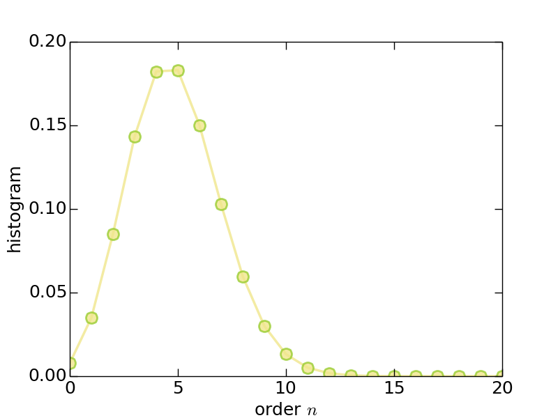
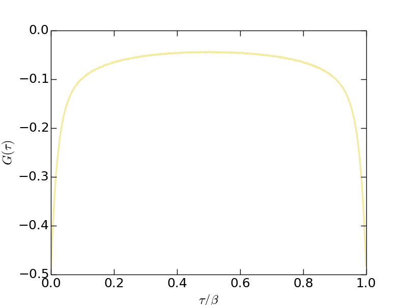
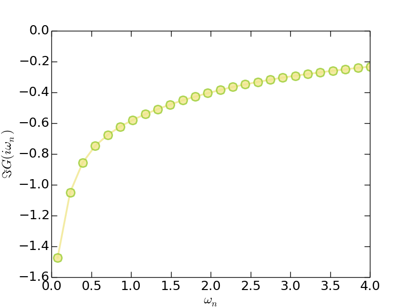
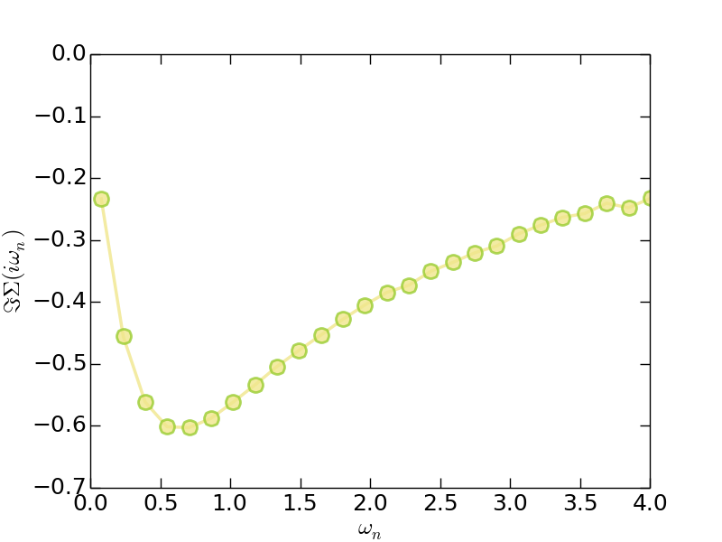
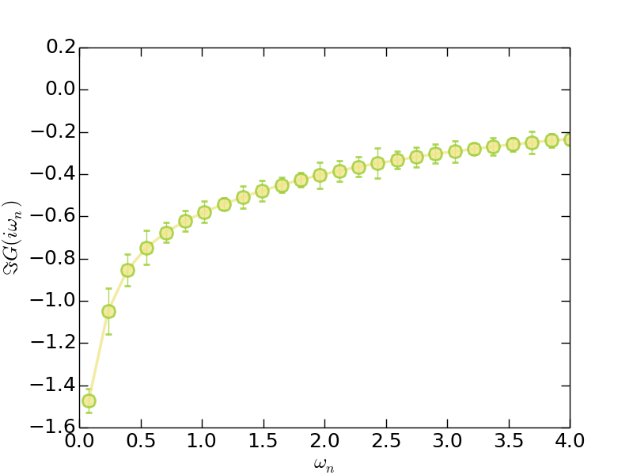

# Hello iQIST!

!!! info

    This tutorial will take you about half an hour.

**Introduction**

Now we will introduce the easiest and simplest application of the iQIST software package --- to solve a single-band Hubbard model on a Bethe lattice within the framework of dynamical mean-field theory.

The general Hubbard model reads:

```math
\begin{equation}
\hat{H} = -t \sum_{\langle ij \rangle\sigma}c^{\dagger}_{i\sigma}c_{j\sigma} + \sum_i \hat{H}^{i}_{\text{loc}},
\end{equation}
```

where ``\hat{H}^{i}_{\text{loc}}`` is the local Hamiltonian on each site ``i``. In the case of the single-band Hubbard model, ``\hat{H}_{\text{loc}}`` reads 

```math
\begin{equation}
\hat{H}_{\text{loc}} =  -\mu \sum_{\sigma}n_{\sigma} + U n_{\uparrow} n_{\downarrow}.
\end{equation}
```

where ``\mu`` is the chemical potential and ``U`` the Coulomb interaction strength. We will solve it using the dynamical mean-field theory with a CT-HYB quantum impurity solver. Then the problem is that how to use the iQIST software package to reach this goal?

**Recipes**

Next we just follow the procedures described in the [iQIST recipes](../ch03/recipes.md) section.

**(1)** Choose suitable component

Since it is a single-band model, all of the quantum impurity solver components in the iQIST software package can be employed. In other words, both the segment representation version and general matrix version of CT-HYB impurity solvers are usable. In this tutorial, we choose the **NARCISSUS** component.

**(2)** Design the programs and scripts

Since the Hubbard model is defined in a Bethe lattice whose density of states is semi-circular, the self-consistent equation for the dynamical mean-field theory reads:

```math
G(\tau) = t^2 \Delta(\tau)
```

As mentioned before, the **NARCISSUS** component (and the other quantum impurity solver components) contains a mini dynamical mean-field engine and the above self-consistent equation is already implemented by default. So, we can use the **NARCISSUS** component alone without help from any external programs or scripts.

**(3)** Prepare the input files

Next, we have to setup the necessary parameters for the **NARCISSUS** component via the *solver.ctqmc.in* file. You can find this file in the *iqist/tutor/t011* directory. Please create your own working directory, and copy the *solver.ctqmc.in* file to it.

```
$ mkdir test11
$ cp iqist/tutor/t11/solver.ctqmc.in test11
$ cd test11
```

The *solver.ctqmc.in* file is attached as follows:

```
!!!-----------------------------------------------------------------------
!!! source  : t11/solver.ctqmc.in
!!! solver  : NARCISSUS
!!! purpose : for tutorial
!!! author  : yilin wang (email:qhwyl2006@126.com)
!!!-----------------------------------------------------------------------

!!>>> setup general control flags
!!------------------------------------------------------------------------
  isscf  : 2
  issun  : 2
  isspn  : 1
  isbin  : 2

!!>>> setup common variables for quantum impurity model
!!------------------------------------------------------------------------
  nband  : 1
  nspin  : 2
  norbs  : 2
  ncfgs  : 4
  niter  : 20
  U      : 2.00
  Uc     : 2.00
  Uv     : 2.00
  Jz     : 0.00
  Js     : 0.00
  Jp     : 0.00
  mune   : 1.00
  beta   : 40.0
  part   : 0.50
  alpha  : 0.70

!!>>> setup common variables for quantum impurity solver
!!------------------------------------------------------------------------
  mkink  : 1024
  mfreq  : 8193
  nfreq  : 128
  ntime  : 1024
  nflip  : 20000
  ntherm : 200000
  nsweep : 20000000
  nwrite : 2000000
  nclean : 100000
  nmonte : 100
  ncarlo : 100
```

Well, at first glance, there are a lot of parameters in it. Relax. Actually, only a few parameters are essential. We will pick them out and explain them one by one.

The important parameters are as follows:

* *isscf = 2*: Define the DMFT self-consistent computational mode.
* *nband = 1*, *norbs = 2*, and *ncfgs = 4*: Specify a single-band Hubbard model.
* *Uc = 2.0*   : Coulomb interaction ``U = 2``.
* *mune = 1.0* : Chemical potential ``\mu``, ``\mu = U/2`` leads to half-filling.
* *beta = 40.0* : Inverse temperature ``\beta``.

In fact, you can create a simplified *solver.ctqmc.in* file which contains only the *Uc*, *mune*, and *beta* parameters. The **NARCISSUS** component will supplement the rest using default settings. As for the format and grammar for the *solver.ctqmc.in* file, see [solver.ctqmc.in](../ch04/in_ctqmc.md) for more details.

**(4)** Let's go

Now everything is ready. We can perform the calculation. Please execute the following command in the terminal, and go on a coffee or tea break.

```
$ ctqmc
```

!!! note

    Here we assume that the executable program for the **NARCISSUS** component is in *iqist/build/ctqmc*, and the directory *iqist/build* has been appended to the environment variable **PATH**.

From the terminal output, we can learn a lot of useful information about the simulation, such as the total energy ``E_{\text{tot}}``, potential energy ``E_{\text{pot}}``, kinetic energy ``E_{\text{kin}}``, magnetic moment ``\langle S_z \rangle``, occupation number ``\langle N^1 \rangle`` and ``\langle N^2 \rangle`` (they can be used to calculate the charge fluctuation), perturbation expansion order ``\langle K^2 \rangle``, ``\langle K^3 \rangle`` and ``\langle K^4 \rangle`` (they can be used to calculate the skewness and kurtosis), Monte Carlo update action statistics, etc. As for more details of the terminal output, please check the [Terminal Output](../ch04/out_term.md) section.

On the other hand, the CT-HYB quantum impurity solvers will generate a few files in the current directory (i.e., *test11* folder in this tutorial), such as *solver.hist.dat*, *solver.green.dat*, etc. You can visualize them using some plotting tools (such as *gnuplot*) occasionally to see whether the results are reasonable. For example, the system with the given parameters must be metallic and half-filling. As for the metallicity, you should check whether the low-frequency ``\Im G(i\omega_n)`` is monotonically increasing (using the *solver.grn.dat* file). For the half-filling criterion, you should check the orbital occupancy in the *solver.nmat.dat* file. The total occupation number should be ``N \cong 1.0``, and the orbital occupation numbers ``n_1 \cong n_2 \cong 0.5``. Due to the numerical noise and round-off error, tiny deviation is inevitable and acceptable.

After a few minutes (in my laptop, it cost about 23 minutes), the calculation is finished.

**(5)** Post-processing

Since the calculation is done, it is time to analyze the calculated results. All of the output data are stored in well-formatted ascii text files. So it is not difficult to read, parse, visualize, and analyze them. In this tutorial, we will show you how to generate figures using the calculated results.

Let's take the histogram data for the perturbation expansion series (stored in the *solver.hist.dat* file) as an example.

**>** Method 1: Using *gnuplot* for a quick plot

```
gnuplot> plot 'solver.hist.dat' u 1:3 w lp
gnuplot> set terminal postscript enhanced solid color eps
gnuplot> set output "hist.eps"
gnuplot> replot
```

As you will see, the figure is in the *hist.eps*. You can improve the above *gnuplot* script to obtain a better visualization.

**>** Method 2: Using Python/matplotlib for a high-quality plot

As is well known, high-quality vector figures are always welcomed by the scientific journals. We strongly recommend to use the Python/matplotlib to generate beautiful and impressive figures. The following Python script can help you to reach this goal.

```python
#!/usr/bin/env python

import numpy
import matplotlib
matplotlib.use("Agg") # setup backend
import matplotlib.pyplot as plt

# read data
order, count, percent, error = numpy.loadtxt('solver.hist.dat', unpack = True)

# plot it
plt.figure(0)
lines = plt.plot(order, percent, alpha = 0.8, clip_on = True)

# setup line properties
plt.setp(lines[0], linewidth = 2.5, marker = 'o', ms = 12, mew = 2, mec = 'yellowgreen', color = 'khaki')

# setup tics
plt.xticks(fontsize = 18)
plt.yticks(fontsize = 18)
plt.tick_params(length = 8, width = 1.0, which = 'major')
plt.tick_params(length = 4, width = 0.5, which = 'minor')

# setup labels
plt.xlabel(r"order $n$", fontsize = 18)
plt.ylabel(r"histogram", fontsize = 18)

# setup yranges
plt.xlim(0.0,20.0)

# output the figure
plt.savefig("hist.png")
```

In the above script, the *numpy.loadtxt()* function is used to read data from the *solver.hist.dat* file. Actually, you can also use the functions implemented in the *script/u_reader.py* to do this job. See [u_reader.py] for more details.

Next we will show some visualized results. The following figures were generated using the above Python script with slight modifications. You can compare them with your own results to see whether your calculations are correct.

* Histogram (*solver.hist.dat*)



**Figure 1** | The histogram for perturbation expansion series.

---

* Imaginary-time Green's function (*solver.green.dat*)



**Figure 2** | The imaginary-time Green's function ``G(\tau)``.

---

* Matsubara Green's function (*solver.grn.dat*)



**Figure 3** | The imaginary part of Matsubara Green's function ``\Im G(i\omega_n)``.

---

* Matsubara self-energy function (*solver.sgm.dat*)



**Figure 4** | The imaginary part of Matsubara self-energy function ``\Im \Sigma(i\omega_n)``.

---

Clearly, from the `` G(i\omega_n) `` and ``\Sigma(i\omega_n)`` data, we can speculate that this system is exactly metallic.

OK. Now this tutorial is over. How do you feel?

**Adventures**

**(1)** Adjust the parameters

You can adjust the *mune*, *beta*, and *nsweep* parameters, and redo the calculations, to see what will happen.

**(2)** Parallel computation

Try to execute the CT-HYB quantum impurity solvers parallelly. Such as 

```
$ mpiexec -n 8 ctqmc
```

Pay attention to the numerical noises and data fluctuations of physical observable. Noted that once the CT-HYB quantum impurity solvers are executed parallelly, the error bars of physical observable should be non-zero. Here is a sample plot:



**Figure 5** | The imaginary part of Matsubara Green's function ``\Im G(i\omega_n)``. The error bar data are magnified by a factor of 10 for a better visualization.

**(3)** Generate animation movie

The iQIST software package provide an unique feature --- to visualize the diagrammatic Monte Carlo steps using short movie clip.

Really? It is funny.

Yes. To use this feature, please setup the *nwrite* and *nsweep* parameters carefully. Only when

```math
\text{nwrite} / \text{nsweep} \geq 100,
```

this feature is actived. Then redo the calculation, and you will get a *solver.diag.dat* file. With the help of *script/u_animator.py*, an animation movie is generated.

**(4)** Try other CT-HYB quantum impurity solvers

In addition to the **NARCISSUS** component, you still can choose the **MANJUSHAKA** component to solve this single-band Hubbard model. The only task you have to do is call the proper executable programs. The *solver.ctqmc.in* file can remain almost unchanged.
