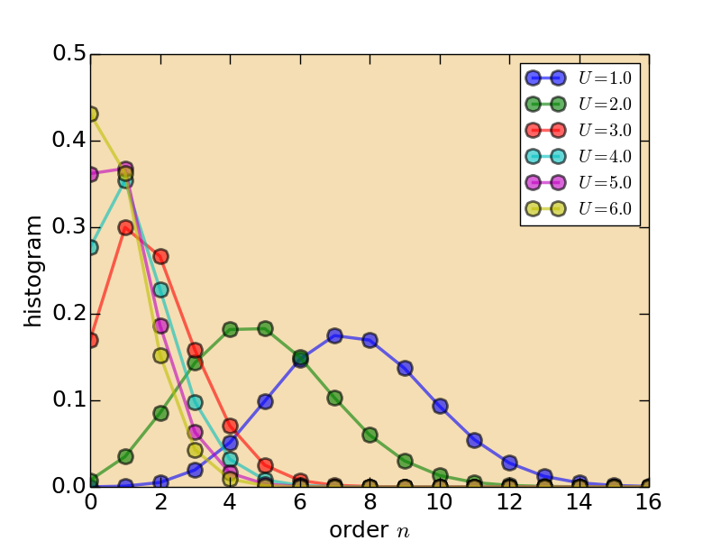

# Mott Metal-Insulator Transition

!!! info

    This tutorial will take you about two hours.

**Introduction**

The Mott metal-insulator transitions in strongly correlated electron systems are always hot topics in the condense matter physics. There are numerous theoretical and experimental studies about it in the last decades. The dynamical mean-field theory is a well-established tool to study the Mott metal-insulator transitions. In the previous tutorial, we learnt how to use the **NARCISSUS** component to solve a single-band Hubbard model within the framework of DMFT. Then in this tutorial, we will go a step further. The central task of this tutorial is show you how to use the iQIST software package to study an interaction-driven Mott metal-insulator transition for a single-band Hubbard model.

The Hamiltonian for the single-band Hubbard model is just the same with the one we have studied in the previous section. Here we won't write it down again. The model parameters are as follows:

* ``U`` = 1.0, 1.5, 2.0, 2.5, 3.0, 3.5, 4.0, 5.0, and 6.0
* ``t`` = 0.5
* ``\beta`` = 40
* ``\mu = U/2``

We will perform a series calculations with various Coulomb interaction ``U`` in this tutorial. The calculated Matsubara Green's function ``G(i\omega_n)`` and self-energy function ``\Sigma(i\omega_n)`` will exhibit drastic changes with respect to the increment of ``U``.

**Recipes**

Next we just follow the procedures described in the [iQIST recipes](../ch03/recipes.md) section.

**(1)** Choose suitable component

Since it is a single-band model, all of the quantum impurity solver components in the iQIST software package can be employed. In other words, both the segment representation version and general matrix version of CT-HYB impurity solvers are usable. In this tutorial, we choose the **NARCISSUS** component.

**(2)** Design the programs and scripts

Since the Hubbard model is defined in a Bethe lattice whose density of states is semi-circular, the self-consistent equation for the dynamical mean-field theory reads:

```math
G(\tau) = t^2 \Delta(\tau)
```

As mentioned before, the **NARCISSUS** component (and the other quantum impurity solver components) contains a mini dynamical mean-field engine and the above self-consistent equation is already implemented by default. So, we can use the **NARCISSUS** component alone without help from any external programs or scripts.

**(3)** Prepare the input files

Next, we have to setup the necessary parameters for the **NARCISSUS** component via the *solver.ctqmc.in* file. Since we have to solve the Hubbard model for a few times with different ``U`` parameters, so we have to prepare several *solver.ctqmc.in* files at the same time. You can find these files in the *iqist/tutor/t012* directory. Noted that there exist a few sub-folders in it. Each folder contains one unique *solver.ctqmc.in* file. For example, in the *iqist/tutor/t012/u40* directory, the *Uc* parameter in the *solver.ctqmc.in* file is just 4.0.

Please create your own working directory, and copy the corresponding *solver.ctqmc.in* file to it.

```
$ mkdir test12
$ mkdir test12/u10 test12/u15 test12/u20 test12/u25 test12/u30 test12/u35 test12/u40 test12/u50 test12/u60
$ cp iqist/tutor/t012/u10/solver.ctqmc.in test12/u10
$ cp iqist/tutor/t012/u15/solver.ctqmc.in test12/u15
$ cp iqist/tutor/t012/u20/solver.ctqmc.in test12/u20
$ cp iqist/tutor/t012/u25/solver.ctqmc.in test12/u25
$ cp iqist/tutor/t012/u30/solver.ctqmc.in test12/u30
$ cp iqist/tutor/t012/u35/solver.ctqmc.in test12/u35
$ cp iqist/tutor/t012/u40/solver.ctqmc.in test12/u40
$ cp iqist/tutor/t012/u50/solver.ctqmc.in test12/u50
$ cp iqist/tutor/t012/u60/solver.ctqmc.in test12/u60
```

These *solver.ctqmc.in* files are similar with each other. The only difference lies in the *Uc* and *mune* parameters. Next, the *iqist/tutor/t012/u10/solver.ctqmc.in* file is attached as a example:

```
!!!-----------------------------------------------------------------------
!!! source  : t012/u10/solver.ctqmc.in
!!! solver  : NARCISSUS
!!! purpose : for tutorial
!!! author  : yilin wang (email:qhwyl2006@126.com)
!!!-----------------------------------------------------------------------

!!>>> setup general control flags
!!------------------------------------------------------------------------
  isscf  : 2
  issun  : 2
  isspn  : 1
  isbin  : 1

!!>>> setup common variables for quantum impurity model
!!------------------------------------------------------------------------
  nband  : 1
  nspin  : 2
  norbs  : 2
  ncfgs  : 4
  niter  : 20
  U      : 1.00
  Uc     : 1.00
  Uv     : 1.00
  Jz     : 0.00
  Js     : 0.00
  Jp     : 0.00
  mune   : 0.50
  beta   : 40.0
  part   : 0.50
  alpha  : 0.70

!!>>> setup common variables for quantum impurity solver
!!------------------------------------------------------------------------
  mkink  : 1024
  mfreq  : 8193
  nfreq  : 128
  ntime  : 1024
  nflip  : 20000
  ntherm : 200000
  nsweep : 20000000
  nwrite : 2000000
  nclean : 100000
  nmonte : 100
  ncarlo : 100
```

Please use the *diff* command or the other file comparison tools to verify the differences between these *solver.ctqmc.in* files. In fact, the *solver.ctqmc.in* file in the *iqist/tutor/t012/u20/* directory is almost identical to the one in the *iqist/tutor/t011* directory.

You can create simplified *solver.ctqmc.in* files which contains only the *Uc*, *mune*, and *beta* parameters. The **NARCISSUS** component will supplement the rest using default settings. As for the format and grammar for the *solver.ctqmc.in* file, see [solver.ctqmc.in](../ch04/in_ctqmc.md) for more details.

**(4)** Let's go

Now everything is ready. We can perform the calculations. Please execute the following Bash shell script in the terminal, and go on a coffee or tea break.

```sh
#!/bin/bash

for u in u*
do
    cd u
    pwd
    ctqmc
    cd ..
done
```

The above shell script will enter each sub-folder and execute the CT-HYB quantum impurity solver one by one. Of course, you can leave this script alone, and execute the *ctqmc* program manually. But it is less efficient. During the calculations, you can check the immediate results from time to time as introduced in the previous tutorial. 

In my Macbook pro 2013, this script cost me about one and a half hour. 

**(5)** Post-processing

We choose the Python/matplotlib again to visualize the calculated results. A typical Python plotting script for the Matsubara Green's function data is as follows. You can modify it to satisfy your requirements.

```python
#!/usr/bin/env python

import numpy
import matplotlib
matplotlib.use("Agg") # setup backend
import matplotlib.pyplot as plt

# read data
bi, omega, sre10, sim10, sre_err, sim_err = numpy.loadtxt('u10/solver.grn.dat', unpack = True)
bi, omega, sre20, sim20, sre_err, sim_err = numpy.loadtxt('u20/solver.grn.dat', unpack = True)
bi, omega, sre30, sim30, sre_err, sim_err = numpy.loadtxt('u30/solver.grn.dat', unpack = True)
bi, omega, sre40, sim40, sre_err, sim_err = numpy.loadtxt('u40/solver.grn.dat', unpack = True)
bi, omega, sre50, sim50, sre_err, sim_err = numpy.loadtxt('u50/solver.grn.dat', unpack = True)
bi, omega, sre60, sim60, sre_err, sim_err = numpy.loadtxt('u60/solver.grn.dat', unpack = True)
omega = omega[0:8192] / 1.0

# plot it
plt.figure(0)
lines = plt.plot(omega, sim10[0:8192], omega, sim20[0:8192], omega, sim30[0:8192], omega, sim40[0:8192], omega, sim50[0:8192], omega, sim60[0:8192], alpha = 0.6, clip_on = True)

# setup line properties
plt.setp(lines[0], linewidth = 2.5, marker = 'o', ms = 12, mew = 2, label = r"$U = 1.0$")
plt.setp(lines[1], linewidth = 2.5, marker = 'o', ms = 12, mew = 2, label = r"$U = 2.0$")
plt.setp(lines[2], linewidth = 2.5, marker = 'o', ms = 12, mew = 2, label = r"$U = 3.0$")
plt.setp(lines[3], linewidth = 2.5, marker = 'o', ms = 12, mew = 2, label = r"$U = 4.0$")
plt.setp(lines[4], linewidth = 2.5, marker = 'o', ms = 12, mew = 2, label = r"$U = 5.0$")
plt.setp(lines[5], linewidth = 2.5, marker = 'o', ms = 12, mew = 2, label = r"$U = 6.0$")

# setup tics
plt.xticks(fontsize = 18)
plt.yticks(fontsize = 18)
plt.tick_params(length = 8, width = 1.0, which = 'major')
plt.tick_params(length = 4, width = 0.5, which = 'minor')

# setup labels
plt.xlabel(r"$\omega_n$", fontsize = 18)
plt.ylabel(r"$\Im G(i\omega_n)$", fontsize = 18)
plt.legend(frameon = True, loc = 'lower right')

# setup yranges
plt.xlim(0.0,4.0)

# output the figure
ax = plt.gca()
ax.patch.set_facecolor('wheat')
plt.savefig("mott_grnf.png")
```

Next we will show some visualized results. The following figures were generated using the above Python script with slight modifications. You can compare them with your own results to see whether your calculations are correct.

* Histogram (*solver.hist.dat*)



**Figure 1** | The histogram for perturbation expansion series.

---

* Imaginary-time Green's function (*solver.green.dat*)


**Figure 2** | The imaginary-time Green's function ``G(\tau)``.

---

* Matsubara Green's function (*solver.grn.dat*)


**Figure 3** | The imaginary part of Matsubara Green's function ``\Im G(i\omega_n)``.

---

According to the ``\Im G(i\omega_n)``, we can conclude that the Mott metal-insulator transition occurs at ``U \in [2,3]``. It would be very helpful if we can determine the critical Coulomb interaction ``U`` for the Mott transition. In the DMFT community, the two quantities are usually used to detect the Mott transition: `` |\beta G(\beta/2)| `` and quasiparticle weight ``Z``. At low temperature, we can use the following approximated equation to calculate ``Z``:

```math
Z \cong \left[1 - \frac{\Im \Sigma(i\omega_0)}{\omega_0} \right]^{-1},
```

where ``\omega_0 \equiv \pi /\beta`` is the lowest Matsubara frequency. When `` |\beta G(\beta/2)| `` and ``Z`` are larger than zero, it is metallic, and vice versa. Then we gather the `` |\beta G(\beta/2)| `` and ``Z`` data from the *solver.green.dat* and *solver.sgm.dat* files, respectively, and then plot figure using them. The figure is shown as follows. As is seen in this figure, the critical ``U`` is 2.5.

* Quasiparticle weight (*solver.sgm.dat*)


**Figure 4** | The ``|\beta G(\beta/2)|`` and quasiparticle weight ``Z``.

---

Besides the ``|\beta G(\beta/2)|`` and quasiparticle weight ``Z``, the double occupation number ``D = \langle nn \rangle`` is another good observable to determine the transition point. In the metallic state, the double occupation number is large. However, it turns small in the insulating phase. See the below figure for a direct impression. The transition point determined by ``D`` is consistent with those by the ``|\beta G(\beta/2)|`` and ``Z``.

* Double occupation number (*solver.nmat.dat*)


**Figure 5** | The double occupation number ``D = \langle nn \rangle``.

---

OK. This tutorial is over. If you can finish this tutorial and the previous one, it means that you have grasped the basic usages of the iQIST software package and become an expert in the DMFT. 

**Adventures**

**(1)** Try other CT-HYB quantum impurity solvers

In addition to the **NARCISSUS** component, you still can choose the **MANJUSHAKA** component to solve this single-band Hubbard model. The only task you have to do is call the proper executable programs. The *solver.ctqmc.in* file can remain almost unchanged.

**(2)** Temperature and hopping parameter

Please adjust the ``\beta`` (*beta*) or ``t`` (part) parameters, and re-visit the Mott metal-insulator transitions again. Pay attention to the evolution of the critical ``U``.

**(3)** Mott metal-insulator transition in multi-orbital Hubbard model

Please change *nband* to 2, and modify the corresponding *norbs*, *ncfgs*, and *mune* parameters, try to find out the transition point for this two-band Hubbard model.
